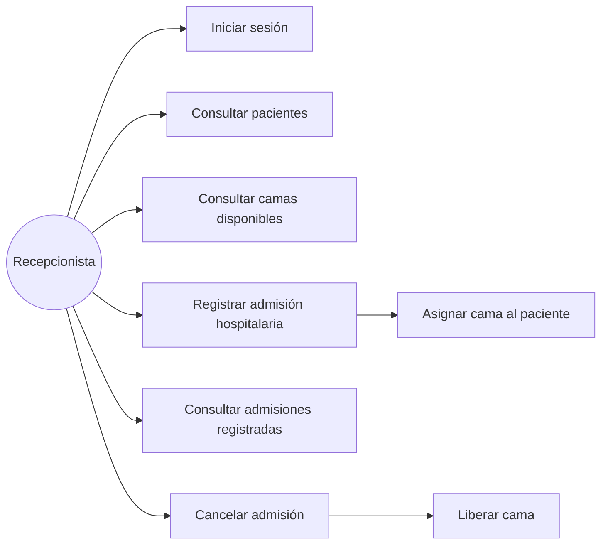
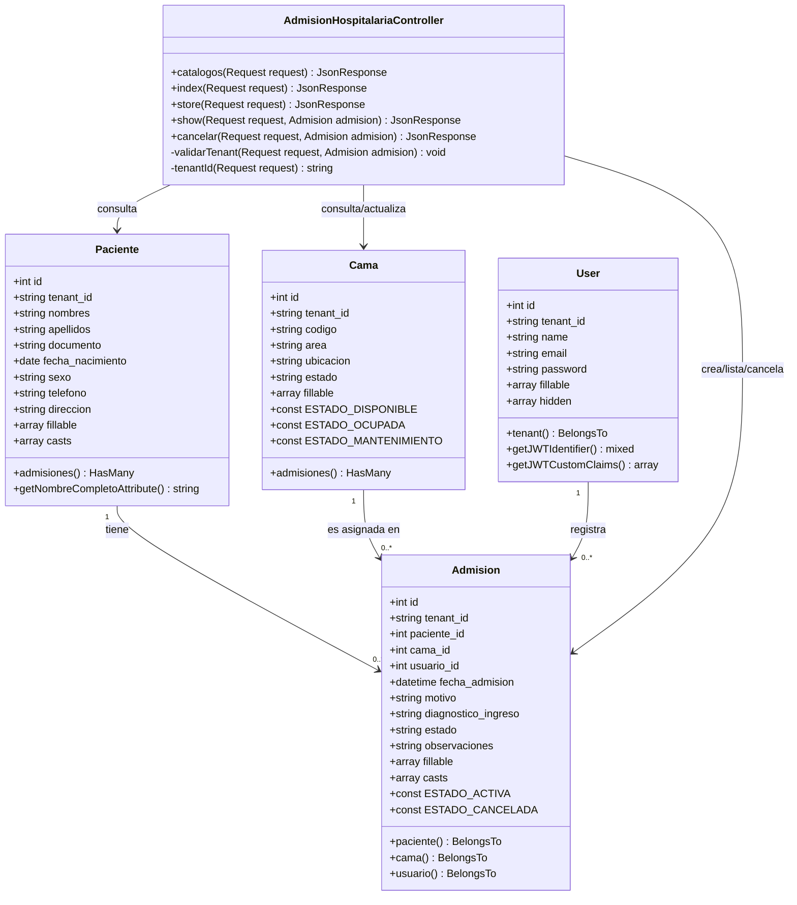
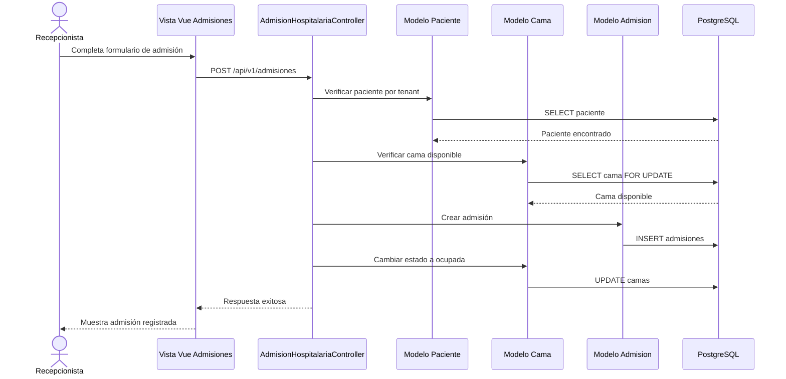
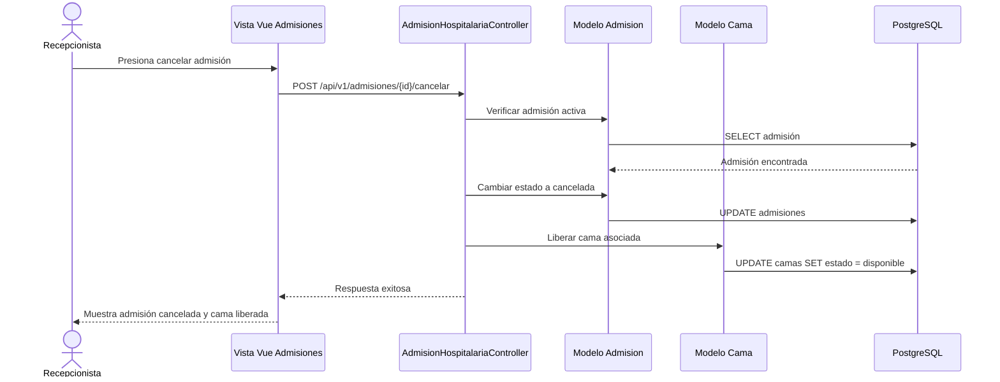

# Diagramas UML - Módulo 8: Admisión hospitalaria

## 1. Diagrama de caso de uso

---

## 2. Diagrama de clases

Este diagrama representa las clases principales implementadas en el módulo de admisión hospitalaria. A diferencia de un diagrama entidad-relación, aquí se incluyen atributos y métodos propios de las clases.

---

## 3. Diagrama de secuencia

---

## 4. Diagrama de secuencia para cancelar admisión

